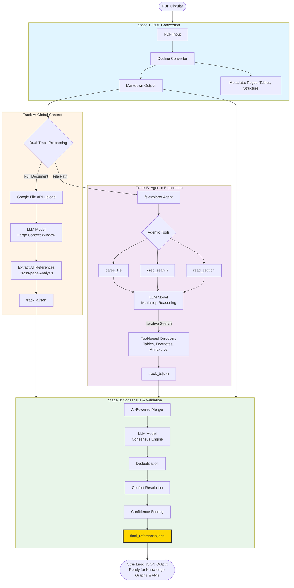

# RELATIO

**Structured reference extraction for SEBI compliance**

Extract and map regulatory relationships from SEBI circular PDFs into structured JSON data for knowledge graph construction and compliance workflows.

---

## Problem Statement

The Head of Compliance for a major Indian bank must ensure compliance with SEBI circulars while being able to respond to SEBI, customers, and intermediaries about the bank's compliance posture. 

**The Challenge:** Most SEBI circulars reference other documentation (circulars, regulations, laws), and since they're all in PDF format, it's difficult to:
- Track which circular supersedes which
- Understand the full compliance context
- Map relationships across regulatory documents
- Respond quickly to compliance queries

**The Solution:** RELATIO uses a dual-track LLM pipeline to automatically extract these references into structured JSON, providing building blocks for knowledge graphs and downstream compliance applications.

---

## Architecture

RELATIO uses a **3-stage dual-track pipeline** for robust, high-recall reference extraction:



### Why Dual-Track?

- **Track A (Global):** Catches cross-document patterns and implicit references using full-context analysis
- **Track B (Agentic):** Finds hidden references in tables, footnotes, and annexures through iterative tool-based exploration
- **Consensus:** AI merger validates and deduplicates, assigning confidence scores based on agreement

**Key Design:** Docling runs only once (Stage 1). Track B uses fs-explorer which has its own document parsing, avoiding redundant PDF processing.

---

## Quick Start

### Prerequisites

- **Python 3.10+**
- **Google Gemini API Key** - Get one free at [Google AI Studio](https://aistudio.google.com/welcome)

### Installation

**Step 1: Clone and Navigate**

```powershell
# If cloning from repository
git clone <your-repo-url>
cd relatio

# Or simply navigate to downloaded folder
cd path\to\relatio
```

**Step 2: Create Virtual Environment**

```powershell
# Create virtual environment
python -m venv .venv

# Activate it (Windows)
.venv\Scripts\activate

# On Linux/Mac:
# source .venv/bin/activate
```

**Step 3: Install Dependencies**

```powershell
# Upgrade pip first
python -m pip install --upgrade pip

# Install all requirements
pip install -r requirements.txt
```

**Step 4: Configure API Key and Models**

```powershell
# Copy the example environment file
copy .env.example .env

# Edit .env and configure your settings
notepad .env
```

**Required configuration in `.env`:**
```env
# Your Gemini API key (REQUIRED)
GOOGLE_API_KEY=your_actual_api_key_here

# Choose your Gemini models (defaults shown, you can change)
TRACK_A_MODEL=gemini-3-flash-preview
TRACK_B_MODEL=gemini-3-flash-preview
CONSENSUS_MODEL=gemini-3-flash-preview
```

---

## Usage

### Basic Extraction

```powershell
# Ensure virtual environment is activated
.venv\Scripts\activate

# Run on a SEBI circular PDF
python main.py path\to\sebi_circular.pdf

# Example with sample file
python main.py samples\1767957683485.pdf
```

### Advanced Options

```powershell
# Custom output directory
python main.py circular.pdf --output results\

# Enable debug logging for troubleshooting
python main.py circular.pdf --debug

# Combine options
python main.py circular.pdf --output custom_folder\ --debug
```

### Output Structure

After running, you'll find results organized in subdirectories:

```
output\
└── <pdf_name>\
    ├── <pdf_name>.md                # Stage 1: Markdown conversion
    ├── <pdf_name>_track_a.json      # Stage 2A: Global context results
    ├── <pdf_name>_track_b.json      # Stage 2B: Agentic search results
    └── <pdf_name>_final.json        # Stage 3: FINAL MERGED OUTPUT ⭐
```

The `*_final.json` file contains the complete, validated reference extraction.

---

## Configuration

All settings are managed via the `.env` file:

### Required Configuration

```env
# Your Google Gemini API key (REQUIRED)
GOOGLE_API_KEY=your_api_key_here
```

### Model Selection

Choose any Gemini models available in your API tier:

```env
# You can use different models for each stage
TRACK_A_MODEL=gemini-2.0-flash-exp      # Global context extraction
TRACK_B_MODEL=gemini-2.0-flash-exp      # Agentic search
CONSENSUS_MODEL=gemini-2.0-flash-exp    # Consensus validation

# Or use other models like:
# - gemini-1.5-pro
# - gemini-1.5-flash
# - gemini-2.0-flash-thinking-exp
```

### Optional Configuration (with defaults)

```env
# PDF Processing
ENABLE_OCR=false                        # Enable for scanned PDFs (slower)
PRESERVE_TABLES=true                    # Maintain table structure in markdown

# Output Settings
OUTPUT_DIR=output                       # Results directory (auto-created)
PRETTY_JSON=true                        # Human-readable JSON formatting
DEBUG_MODE=false                        # Detailed logging
```

See [.env.example](file:///c:/Users/shory/Desktop/relatio/.env.example) for all available options.

---

## Output Schema

The final JSON output follows a structured schema designed for easy integration with knowledge graphs, databases, and compliance APIs.

### Source Document Metadata

```json
{
  "source_document": {
    "filename": "sebi_circular_2024_120.pdf",
    "circular_title": "Master Circular on Portfolio Management Services",
    "sebi_reference_number": "SEBI/HO/MIRSD/2024/120",
    "date_issued": "2024-09-15",
    "total_pages": 47,
    "processing_timestamp": "2026-01-21T12:53:00Z"
  }
}
```

### Extracted References

Each reference includes rich metadata for knowledge graph construction:

```json
{
  "references": [
    {
      "reference_id": "REF001",
      "referenced_document_title": "Guidelines on Portfolio Management Services",
      "referenced_sebi_number": "SEBI/HO/MIRSD/2023/105",
      "referenced_date": "2023-03-20",
      "document_type": "SEBI_CIRCULAR",
      "relationship_type": "SUPERSEDES",
      "page_numbers": [1, 2],
      "exact_citation_text": "This circular supersedes SEBI/HO/MIRSD/2023/105...",
      "context_paragraph": "Full paragraph providing context...",
      "section_location": "Preamble - Section 1.1",
      "confidence_score": 0.98,
      "extraction_source": "BOTH"
    }
  ]
}
```

**Document Types:**
- `SEBI_CIRCULAR` - SEBI circulars
- `ACT` - Legislative acts (e.g., SEBI Act 1992)
- `REGULATION` - SEBI regulations
- `GUIDELINE` - Guidelines and master circulars
- `NOTIFICATION` - Official notifications
- `OTHER` - Other regulatory documents

**Relationship Types:**
- `SUPERSEDES` - Replaces the referenced document entirely
- `AMENDS` - Modifies specific parts
- `REPEALS` - Cancels/invalidates
- `REFERS_TO` - General reference
- `CLARIFIES` - Provides additional explanation
- `DERIVES_FROM` - Based on/authorized by

**Confidence Scores:**
- **High (0.90-1.0):** Found by both tracks, validated
- **Medium (0.70-0.89):** Found by one track, reliable
- **Low (0.50-0.69):** Needs manual review

**Extraction Source:**
- `BOTH` - Found by Track A and Track B (highest confidence)
- `TRACK_A` - Found only by global context analysis
- `TRACK_B` - Found only by agentic exploration

### Summary Statistics

```json
{
  "summary_statistics": {
    "total_references_found": 7,
    "by_document_type": {
      "SEBI_CIRCULAR": 5,
      "ACT": 1,
      "REGULATION": 1
    },
    "by_relationship_type": {
      "SUPERSEDES": 1,
      "REFERS_TO": 4,
      "AMENDS": 2
    },
    "by_confidence_level": {
      "high": 6,
      "medium": 1,
      "low": 0
    }
  }
}
```

### Processing Metadata

```json
{
  "processing_metadata": {
    "pipeline_version": "1.0.0",
    "models_used": {
      "track_a": "gemini-2.0-flash-exp",
      "track_b": "gemini-2.0-flash-exp",
      "consensus": "gemini-2.0-flash-exp"
    },
    "processing_time_seconds": 245,
    "track_a_references_found": 6,
    "track_b_references_found": 5,
    "merged_count": 7,
    "duplicates_removed": 4,
    "validation_status": "COMPLETED"
  }
}
```

---

## How It Works

### Stage 1: PDF to Markdown

- **Tool:** Docling library (IBM Research)
- **Process:** Converts PDF to structured markdown
- **Preserves:** Tables, page numbers, document hierarchy
- **Output:** Clean markdown for LLM processing

### Stage 2A: Global Context (Track A)

- **Method:** Full-document analysis with Google File API
- **Approach:** Uploads markdown to LLM for single-pass comprehensive extraction
- **Strengths:** Cross-page references, implicit relationships, document-wide context
- **Strategy:** Leverages large context windows to understand the entire circular

### Stage 2B: Agentic Search (Track B)

- **Tool:** fs-explorer (agentic file search framework)
- **Approach:** Multi-step reasoning with tool use
- **Tools Available:**
  - `parse_file` - Read document sections
  - `grep_search` - Pattern matching
  - `read_section` - Targeted content extraction
- **Strengths:** Tables, footnotes, annexures, iterative discovery
- **Strategy:** Agent decides where to look next based on findings

### Stage 3: Consensus Validation

- **Process:** AI-powered merger and deduplication
- **Steps:**
  1. Merge results from both tracks
  2. Deduplicate identical references
  3. Resolve conflicts (pick best metadata)
  4. Assign confidence scores based on track agreement
  5. Validate against source document

**Smart Optimization:** Docling runs only once in Stage 1. Track B's fs-explorer has built-in document parsing, avoiding redundant processing.

---

## Why This Approach? (Not Traditional RAG)

### Limitations of Traditional RAG

Traditional RAG (Retrieval-Augmented Generation) has fundamental limitations for regulatory document analysis:

1. **Chunks lose context** - Splitting circulars destroys relationships between sections. A reference on page 5 to "Annexure B on page 23" becomes meaningless when chunked.

2. **Cross-references are invisible** - "See Exhibit B" or "as mentioned in Section 3.2" mean nothing to embeddings since the context is fragmented.

3. **Similarity ≠ Relevance** - Semantic matching finds similar text, not logical connections. Two sections might be semantically similar but reference completely different regulations.

4. **Table structure is lost** - RAG chunking breaks tables apart, making it impossible to extract tabular references accurately.

### Our Solution: Dual-Track Agentic Extraction

Inspired by **[agentic-file-search](https://github.com/PromtEngineer/agentic-file-search)** and **LLM council** / **prompt engineering ensemble** techniques, we use:

**Track A (Global Context):**
- Analyzes the **entire document** without chunking
- Leverages Gemini's large context window (up to 1M tokens)
- Understands cross-page relationships and document structure
- Similar to having an expert read the full circular once

**Track B (Agentic Exploration):**
- Uses **fs-explorer** framework with 6 specialized tools
- Agent iteratively explores: `scan_folder` → `parse_file` → `grep` → `read`
- Follows cross-references dynamically (e.g., "see page 23" → agent reads page 23)
- Focuses on tables, footnotes, and annexures that Track A might miss

**Consensus Stage (LLM Council):**
- Merges both perspectives using AI consensus
- Deduplicates and resolves conflicts
- Assigns confidence based on agreement (both tracks found = high confidence)
- Similar to expert panel reviewing findings

### Why It Works Better

| Aspect | Traditional RAG | Our Agentic Approach |
|--------|----------------|---------------------|
| Context preservation | ❌ Lost in chunking | ✅ Full document analysis |
| Cross-references | ❌ Invisible | ✅ Agent follows them |
| Table handling | ❌ Structure destroyed | ✅ Parsed intact |
| Iterative search | ❌ Static retrieval | ✅ Dynamic exploration |
| Confidence scoring | ❌ Single source | ✅ Dual-track validation |

---

## Example Execution

Here's a real extraction run on a 10-page SEBI circular using `gemini-2.5-flash`:

```powershell
(.venv) PS C:\Users\shory\Desktop\relatio> python main.py .\samples\1767957683485.pdf

======================================================================
            RELATIO: MAPPING THE DNA OF REGULATORY EVOLUTION
======================================================================

  SOURCE PDF:  1767957683485.pdf
  OUTPUT DIR:  output\1767957683485

[1/4] PDF Conversion (Gemini)...
2026-01-21 18:48:01,605 - google_genai.models - INFO - AFC is enabled with max remote calls: 10.
      [  DONE  ] Markdown Generated: 1767957683485.md

[2/4] Global Extraction (Track A)...
2026-01-21 18:48:25,415 - relatio.extract_global - INFO - Starting Track A: Global Context Analysis
2026-01-21 18:48:27,869 - relatio.extract_global - INFO - Uploaded file: files/5ts5e5fxpsmw
2026-01-21 18:48:27,870 - google_genai.models - INFO - AFC is enabled with max remote calls: 10.
2026-01-21 18:48:51,466 - relatio.extract_global - INFO - Deleted uploaded file
2026-01-21 18:48:51,467 - relatio.extract_global - INFO - Track A extracted 5 references
✓ Saved: output\1767957683485\1767957683485_track_a.json
      [  DONE  ] Track A Result: 1767957683485_track_a.json

[3/4] Agentic Extraction (Track B)...
2026-01-21 18:48:51,471 - relatio.extract_agentic - INFO - Starting Track B: Agentic Exploration
2026-01-21 18:48:51,474 - relatio.extract_agentic - INFO - Agent working directory: output\1767957683485
2026-01-21 18:48:51,510 - google_genai.models - INFO - AFC is enabled with max remote calls: 10.
2026-01-21 18:48:55,284 - google_genai.models - INFO - AFC is enabled with max remote calls: 10.
2026-01-21 18:49:16,978 - relatio.extract_agentic - INFO - Agent completed successfully
2026-01-21 18:49:16,980 - relatio.extract_agentic - INFO - Track B extracted 5 references
✓ Saved: output\1767957683485\1767957683485_track_b.json
      [  DONE  ] Track B Result: 1767957683485_track_b.json

[4/4] Final Consensus & Merging...
2026-01-21 18:49:17,081 - google_genai.models - INFO - AFC is enabled with max remote calls: 10.
2026-01-21 18:50:31,127 - relatio.merge_consensus - ERROR - AI Consensus failed: Expecting value: line 40 column 25 (char 1857)
2026-01-21 18:50:31,130 - relatio.merge_consensus - INFO - Filtering out self-reference: HO/38/44/12(1)2026-MIRSD-TPD1
✓ Saved: output\1767957683485\1767957683485_final.json
      [  DONE  ] Final Output: 1767957683485_final.json

----------------------------------------------------------------------

======================================================================
                           EXECUTION SUMMARY
======================================================================

  STAGE           DURATION   STATUS
  --------------  ---------  -------
  1. Conversion   27.47s     DONE
  2. Track A      26.06s     DONE
  3. Track B      25.51s     DONE
  4. Consensus    74.15s     DONE

      [ TOTAL TIME ]   : 153.19s (2.5 minutes)
      [ FINAL JSON ]   : output\1767957683485\1767957683485_final.json

======================================================================
```

### Performance Notes

- **Document:** 10 pages
- **Total Time:** ~2.5 minutes
- **Model:** gemini-2.5-flash
- **References Found:** 5 unique references (deduplicated from 10 total findings)
- **Rate Limits:** 2 RPM, 5.2K TPM / 250K daily, 3 RPD / 20 ([view limits](https://ai.google.dev/pricing))

---

## Testing

### Download Sample Circulars

**Option 1: Manual Download**

1. Visit [SEBI Circulars](https://www.sebi.gov.in/sebiweb/home/HomeAction.do?doListing=yes&sid=1&ssid=7&smid=0)
2. Download a Master Circular (these have many references)
3. Save to `samples\` directory

**Option 2: Use Helper Script**

```powershell
python download_samples.py
```

This provides instructions for downloading circulars directly from SEBI's website.

### Run Extraction

```powershell
# Process a sample circular
python main.py samples\your_circular.pdf

# View results
type output\your_circular\your_circular_final.json
```

### Verify Output

```powershell
# Check final results (Windows)
type output\your_circular\your_circular_final.json

# Or use PowerShell for formatted output
Get-Content output\your_circular\your_circular_final.json | ConvertFrom-Json | ConvertTo-Json -Depth 10
```

---

## Evaluation

### Manual Verification Process

1. **Open Side-by-Side:** Source PDF and `*_final.json`
2. **Count References:** Manually identify all regulatory references in the PDF
3. **Compare:** Check extraction accuracy, page numbers, citation text
4. **Review Low-Confidence:** Manually verify references with confidence < 0.7

### Metrics

- **Recall:** References Found / Total Actual References (Target: **>90%**)
- **Precision:** Correct References / Total Extracted (Target: **>85%**)
- **F1 Score:** Harmonic mean of precision and recall (Target: **>87%**)

### Confidence-Based Review

- **High (>0.9):** Spot-check only (~5% sample)
- **Medium (0.7-0.9):** Review carefully (~25% sample)
- **Low (<0.7):** Manual verification required (100%)

---

## Limitations

### Current Known Issues (v1.0)

1. **Implicit References** (~5-10% miss rate)
   - Phrases like "aforementioned circular" without explicit citation
   - **Mitigation:** Track B specifically searches for these patterns

2. **Old Citation Formats** (~10-15% degradation on pre-2010 circulars)
   - Pre-2010 SEBI circulars use different reference patterns
   - **Mitigation:** Extend regex patterns in [utils.py](file:///c:/Users/shory/Desktop/relatio/utils.py)

3. **Scanned PDFs** (OCR-dependent accuracy)
   - Requires `ENABLE_OCR=true` in `.env`
   - Processing time increases 3-5x
   - **Mitigation:** Use high-quality PDFs when available

4. **Processing Time** (4-5 minutes per document)
   - Not suitable for real-time applications
   - **Mitigation:** Batch processing, parallel execution

5. **API Rate Limits** (Free tier: 1,500 requests/day)
   - ~150 documents per day maximum on free tier
   - **Mitigation:** Upgrade to paid tier for production scale

---

## Scaling & Downstream Applications

The structured JSON output can be used for various downstream tasks:

### Batch Processing

Process all SEBI circulars in bulk:

```powershell
# PowerShell script for batch processing
Get-ChildItem sebi_circulars\*.pdf | ForEach-Object {
    python main.py $_.FullName
}
```

### Knowledge Graph Construction

The JSON output is designed for easy import into graph databases:

- **Nodes:** `source_document` and `references` become circular nodes
- **Edges:** `relationship_type` defines edge types (SUPERSEDES, AMENDS, etc.)
- **Properties:** `confidence_score`, `page_numbers`, `context_paragraph`, etc.

### API Integration

Build RESTful APIs or GraphQL endpoints on top of the JSON data:

```python
# Example: Query evolved circulars
GET /api/circular/{sebi_ref}/supersedes
# Returns: All circulars superseded by this one

# Example: Find all references
GET /api/circular/{sebi_ref}/references  
# Returns: All regulatory documents referenced

# Example: Trace evolution
GET /api/circular/{sebi_ref}/evolution
# Returns: Complete chain of regulatory evolution
```

### Compliance Workflows

- **Regulatory monitoring** - Track new circulars and their impacts
- **Impact analysis** - Understand which circulars are affected by changes
- **Compliance reporting** - Generate reports on regulatory dependencies
- **Search & discovery** - Full-text search across circular corpus

### Data Storage Options

The JSON format can be imported into:
- **Document databases** - MongoDB, CouchDB (native JSON support)
- **Relational databases** - PostgreSQL JSONB, MySQL JSON columns
- **Graph databases** - Neo4j, ArangoDB, Amazon Neptune
- **Search engines** - Elasticsearch, OpenSearch (indexed JSON)

---

## Project Structure

```
relatio/
├── .env.example              # Environment template
├── .env                      # Your configuration (create from example)
├── README.md                 # This file
├── requirements.txt          # Python dependencies
├── requirements-lock.txt     # Locked dependency versions
├── pyproject.toml            # Project metadata
├── main.py                   # 🎯 Pipeline orchestrator (start here)
├── convert_pdf.py            # Stage 1: PDF → Markdown (Docling)
├── extract_global.py         # Stage 2A: Global context (Track A)
├── extract_agentic.py        # Stage 2B: Agentic search (Track B)
├── merge_consensus.py        # Stage 3: Consensus validation
├── models.py                 # Pydantic data models (output schema)
├── utils.py                  # Shared utilities (logging, JSON, etc.)
├── download_samples.py       # Helper to download SEBI circulars
├── list_models.py            # List available Gemini models
├── samples/                  # Test PDFs (auto-created)
└── output/                   # Extraction results (auto-created)
    └── <pdf_name>/
        ├── <pdf_name>.md
        ├── <pdf_name>_track_a.json
        ├── <pdf_name>_track_b.json
        └── <pdf_name>_final.json  ⭐
```

---

## Troubleshooting

### "GOOGLE_API_KEY not found"

- Ensure `.env` file exists in project root
- Copy from `.env.example` if missing
- Add your actual API key: `GOOGLE_API_KEY=your_key_here`
- Restart terminal/IDE after editing `.env`

### "PDF file not found"

- Check file path is correct (use absolute paths if needed)
- Ensure PDF is not corrupted
- Verify file extension is `.pdf`

### "Docling conversion failed"

- PDF may be corrupted or password-protected
- Try enabling OCR: `ENABLE_OCR=true` in `.env`
- Check PDF has actual text (not just scanned image)

### Low reference count / Missing references

1. Enable debug logging:
   ```powershell
   python main.py circular.pdf --debug
   ```

2. Check intermediate files in `output\<pdf_name>\`:
   - `*_track_a.json` - What Track A found
   - `*_track_b.json` - What Track B found
   - Compare with source PDF

3. Verify PDF quality (not low-resolution scan)

4. For scanned PDFs, enable OCR:
   ```env
   ENABLE_OCR=true
   ```

### "Module not found: fs_explorer"

The fs-explorer package installs from GitHub. If installation failed:

```powershell
# Reinstall from GitHub directly
pip install git+https://github.com/PromtEngineer/agentic-file-search.git

# Or reinstall all dependencies
pip install -r requirements.txt --force-reinstall
```

### API Rate Limit Errors

Free tier: 1,500 requests/day (~150 documents)

**Solutions:**
- Reduce processing: Process only essential circulars first
- Upgrade to paid tier: [Google AI Studio Pricing](https://ai.google.dev/pricing)
- Use caching: Re-run failed documents without reprocessing successful ones

---

## Dependencies

### Core Requirements

- **docling** ≥2.55.0 - PDF parsing and conversion
- **google-generativeai** ≥0.8.0 - Gemini API (legacy SDK)
- **google-genai** ≥1.55.0 - Gemini API (new SDK)
- **pydantic** ≥2.0.0 - Data validation and schema
- **python-dotenv** ≥1.0.0 - Environment configuration

### Agentic Search (Track B)

- **fs-explorer** - Agentic file search framework (from GitHub)
- **llama-index-workflows** ≥2.11.5 - Agentic orchestration
- **fastapi** ≥0.115.0 - Web server for fs-explorer
- **uvicorn** ≥0.34.0 - ASGI server
- **websockets** ≥14.0 - WebSocket support

### Utilities

- **requests** ≥2.31.0 - HTTP client
- **tqdm** ≥4.66.0 - Progress bars
- **reportlab** ≥4.4.7 - PDF utilities

See [requirements.txt](file:///c:/Users/shory/Desktop/relatio/requirements.txt) for complete list.

---

## License

MIT License - See LICENSE file for details

---

**Built for regulatory compliance professionals**